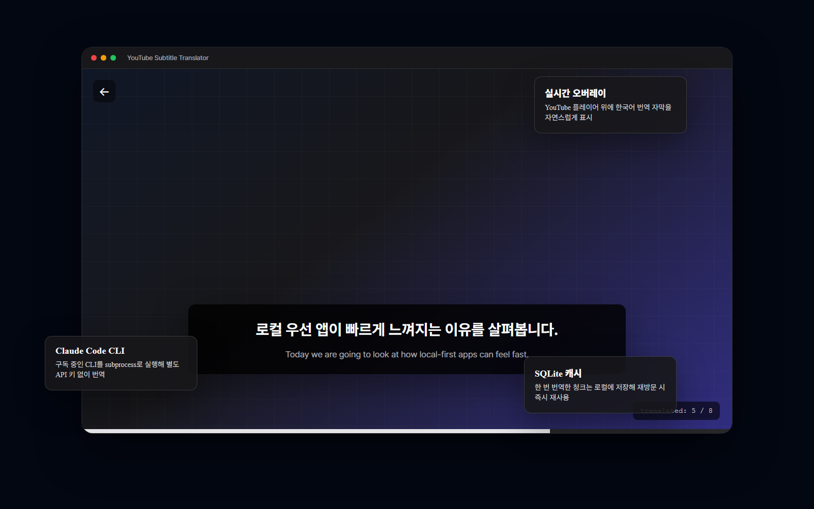
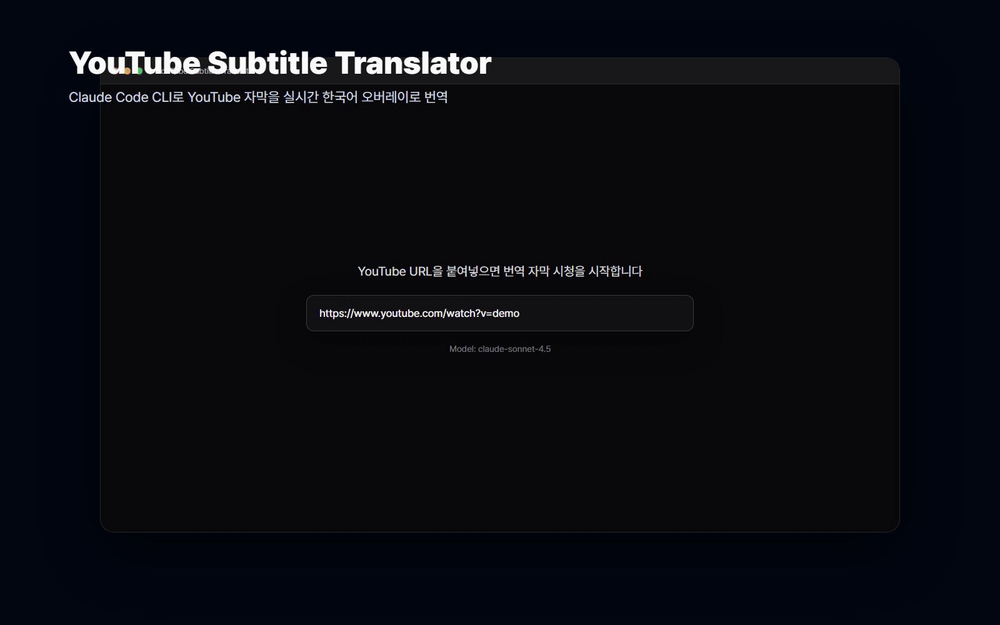
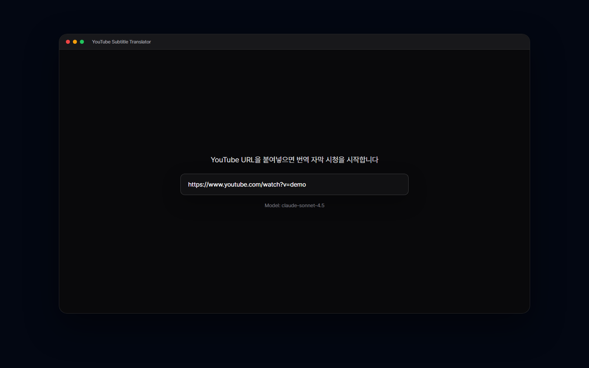
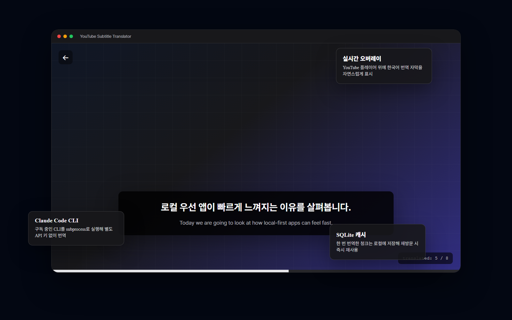

# YouTube Subtitle Translator

[](LICENSE)
[](https://v2.tauri.app)
[](https://www.rust-lang.org)
[](https://www.typescriptlang.org)

YouTube 영상의 자막을 **Claude Code CLI**로 실시간 번역해 영상 위에 한국어 오버레이로 보여주는 Tauri 데스크톱 앱입니다.

Claude Code 구독을 활용하므로 별도 API 키나 API 과금 없이, YouTube 자막 fetch와 Claude Code CLI 번역을 데스크톱 앱에서 오케스트레이션하고 번역 캐시는 로컬 SQLite에 저장합니다.



## 왜 이 앱인가

| 가치 | 설명 |
|------|------|
| 실시간 오버레이 | YouTube 플레이어 위에 번역 자막을 자연스럽게 표시합니다 |
| 청크 기반 번역 | 긴 영상도 30초-1분 단위로 나누어 빠르게 번역을 시작합니다 |
| 로컬 캐시 | 한 번 번역한 자막은 SQLite에 저장해 동일 영상 재방문 시 재사용합니다 |
| 별도 API 키 불필요 | Claude Code CLI 로그인 상태를 사용하므로 추가 API 키를 요구하지 않습니다 |

## 데모



[MP4 데모 보기](docs/assets/readme/demo.mp4)

| Home | Player |
|------|--------|
|  |  |

## 빠른 시작

### 사전 요구사항

- [Node.js](https://nodejs.org) 18+
- [pnpm](https://pnpm.io)
- [Rust](https://rustup.rs)
- [Tauri 사전 요구사항](https://v2.tauri.app/start/prerequisites/)
- [Claude Code CLI](https://docs.anthropic.com/en/docs/claude-code) 설치 및 로그인 완료

### 실행

```bash
git clone https://github.com/CaesiumY/cc-youtube-sub.git
cd cc-youtube-sub
pnpm install
pnpm tauri dev
```

브라우저 모드에서 프론트엔드만 확인하려면 다음 명령을 사용합니다.

```bash
pnpm dev
```

## 주요 기능

- **실시간 자막 번역**: YouTube 재생 중 Claude Code CLI가 자막을 한국어로 번역합니다.
- **자막 오버레이**: 영상 위에 반투명 자막 박스를 표시하고 원문/번역을 토글할 수 있습니다.
- **사전 버퍼링**: 재생 위치 앞 청크를 미리 번역해 시청 중 끊김을 줄입니다.
- **SQLite 캐시**: `(video_id, chunk_hash)` 기준으로 번역 결과를 저장합니다.
- **긴 영상 대응**: 자막을 30초-1분 단위로 나누어 긴 강의나 발표 영상도 처리합니다.
- **데스크톱 UX**: Tauri v2 기반으로 Windows 우선 데스크톱 앱 경험을 제공합니다.

## 작동 방식

```text
YouTube URL 입력
  -> 자막 fetch
  -> 30초-1분 청크 분할
  -> SQLite 캐시 확인
  -> 캐시 miss 청크를 Claude Code CLI subprocess로 번역
  -> JSON 결과 검증
  -> 캐시 저장
  -> 영상 위 자막 오버레이 표시
```

재생 위치가 바뀌면 Rust BufferManager가 현재 위치 기준으로 우선 번역할 청크를 다시 계산합니다. 캐시 hit 위치는 즉시 표시하고, 캐시 miss 위치는 번역 준비 상태를 보여준 뒤 완료되는 즉시 자막을 갱신합니다.

## 기술 스택

| 영역 | 기술 |
|------|------|
| Desktop | Tauri v2, Rust 2021, Tokio |
| Frontend | React 19, TypeScript 5.7, Vite 6 |
| Routing / State | TanStack Router, TanStack Query, Zustand |
| Styling | Tailwind CSS v4, Pretendard, Motion |
| Translation | Claude Code CLI subprocess, stream-json parsing |
| Subtitle / Cache | yt-transcript-rs, reqwest, regex, rusqlite |

## 개발 명령어

```bash
# Tauri 앱 + Vite dev server
pnpm tauri dev

# 프론트엔드만 실행
pnpm dev

# 프로덕션 빌드
pnpm tauri build

# 린트와 포맷 검사
pnpm check

# 프론트엔드 테스트
pnpm test

# Rust 테스트
cd src-tauri && cargo test

# Rust 린트
cd src-tauri && cargo clippy
```

## 프로젝트 구조

```text
cc-youtube-sub/
├── src/                        # React 프론트엔드
│   ├── routes/                 # Home, Player 라우트
│   ├── components/             # URL 입력, YouTube Player, 자막 오버레이
│   ├── hooks/                  # 번역 파이프라인, 버퍼링, 단축키
│   ├── stores/                 # Zustand UI 상태
│   └── lib/                    # Tauri command wrapper, mock-tauri, 유틸리티
├── src-tauri/                  # Rust 백엔드
│   └── src/
│       ├── subtitle/           # 자막 fetch, 파싱, 청크 분할
│       ├── translate/          # 프롬프트, JSONL 파싱, 검증
│       ├── claude/             # Claude Code CLI 프로세스 관리
│       ├── cache.rs            # SQLite 캐시
│       └── buffer_manager.rs   # 재생 위치 기반 사전 번역
├── docs/                       # PRD, 설계 문서, 테스트 전략
└── docs/assets/readme/         # README 이미지와 데모 영상
```

## 키보드 단축키

| 키 | 동작 |
|----|------|
| `T` | 원본 자막 / 번역 토글 |
| `F` | 풀스크린 |
| `+` / `-` | 자막 크기 조절 |
| `Space` | 재생 / 일시정지 |

## 문서

- [PRD](docs/prd.md)
- [기술 스택](docs/tech-stack.md)
- [테스트 전략](docs/test-strategy.md)
- [디자인 시스템](docs/design-system.md)
- [Phase 계획](docs/phases/overview.md)

## 라이선스

[MIT](LICENSE) &copy; 2026 ChangSik Yoon
